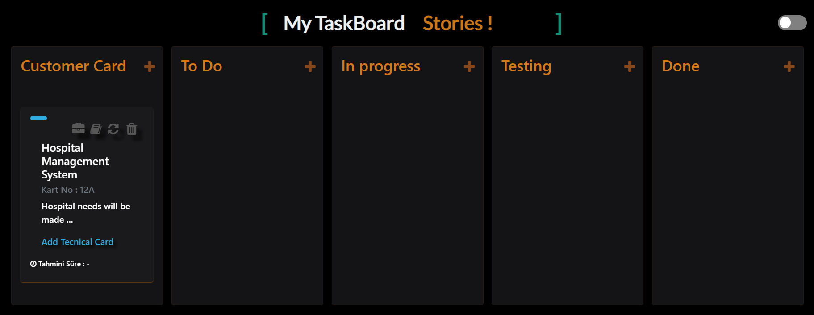

# .Net-Framework-TaskBoard

  
Taskboard is a job tracking application.

<ul>
  <li>Müşteri Kartının Eklenmesi <strong> (Add Customer Card): </strong></li>
  
Yukarıdaki gif üzerinde görünen Customer Card bölümündeki artı butonuna tıklayınız ve aşağıda gördüğününüz müşteri kartı bilgilerini girerek ekle butonuna tıklayanız.  
 <strong> --> (Click the plus button in the Customer Card section that appears on the gif and enter the customer card information you see below and click the add button.) </strong>

</img>

 <li>Müşteri kartının eklendikten sonraki görüntüsü aşağıdaki gibi olmalıdır.<strong> (Image after adding the customer card) </strong></li>  
 
 </img>
 
  <li>Müşteri Kartının Güncellenmesi  <strong> (Update Customer Card):  </strong></li>
  
Eklenen müşteri kartı kart üzerindeki güncelle(refresh) butonuna tıklanarak açılan aşağıdaki ekran üzerinden istenilen yerlerin değiştirilmesinden sonra güncelle butonuna tıklanarak işlem gerçekleştirilir.  
 <strong> --> (The update button is clicked. After changing the desired places on the screen below, the process is executed by clicking the update button.)
</strong>

 
</ul>
