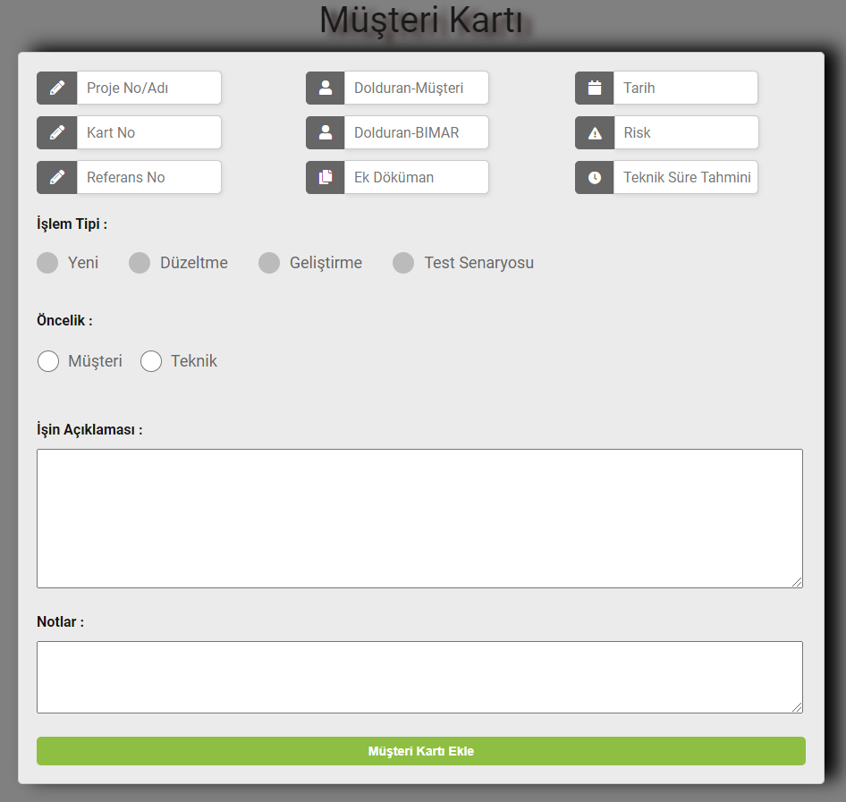

# .Net-Framework-TaskBoard

  
Taskboard is a job tracking application.

<ul>
  <li>Müşteri Kartının Eklenmesi <strong> (Add Customer Card): </strong></li>
  
Yukarıdaki gif üzerinde görünen Customer Card bölümündeki artı butonuna tıklayınız ve aşağıda gördüğününüz müşteri kartı bilgilerini girerek ekle butonuna tıklayanız.  
 <strong> --> (Click the plus button in the Customer Card section that appears on the gif and enter the customer card information you see below and click the add button.) </strong>

</img>

</ul>
